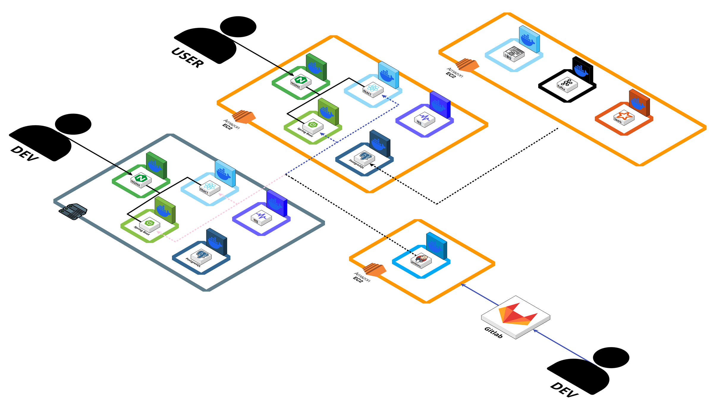

<h1>NewSpeaking</h1>
<h3>최신 뉴스 기반 AI 프리토킹 연습 플랫폼</h3>

최신 뉴스 영어 단어 데이터 및 음소 분석 특화 AI 모델 기반 영어 프리토킹 연습 서비스

 

# 아키텍처

 

# 기술 스택

### Frontend

### Backend

### AI

### Data

### Infrastructure

### DevOps & Tools

 

# 주요 기능

<table width="100%">
<tr align="center"><th width="25%">기능</th><th width="75%">설명</th></tr>
<tr><td><strong>음소 단위 발음 평가</strong></td><td>사용자의 음성을 녹음하고 음소 단위로 발음을 분석해 구체적인 교정 피드백 제공</td></tr>
<tr><td><strong>학습 대시보드</strong></td><td>누적 학습 기록을 그래프·차트로 시각화해 발음 정확도 및 학습 추이 확인</td></tr>
<tr><td><strong>뉴스 기반 학습</strong></td><td>BBC·CNN 등 최신 뉴스 문장을 활용해 시의성 있는 실전 영어 학습</td></tr>
<tr><td><strong>맞춤 단어 연습</strong></td><td>자주 틀리거나 연습하고 싶은 단어를 저장해 개인 맞춤 발음 연습</td></tr>
<tr><td><strong>쉐도잉</strong></td><td>원하는 유튜브 영상·뉴스를 선택해 따라 말하기 연습</td></tr>
</table>

 

# 시스템 구성

<table width="100%">
<tr align="center"><th width="30%">구성</th><th width="70%">역할</th></tr>
<tr><td><strong>웹 프론트엔드</strong></td><td>발음 녹음·재생, 대시보드 시각화, 뉴스·쉐도잉 학습 UI 제공</td></tr>
<tr><td><strong>서비스 백엔드</strong></td><td>회원 인증·인가, 학습 기록 관리, AI 분석 요청 중계</td></tr>
<tr><td><strong>AI 발음 분석 서버</strong></td><td>Whisper STT와 g2p 음소 정렬 기반 발음 평가·피드백 생성</td></tr>
<tr><td><strong>데이터 파이프라인</strong></td><td>뉴스 기사 크롤링, Kafka·Spark 기반 단어 데이터베이스 구축</td></tr>
</table>

 

# 레포지토리

<table width="100%">
<tr align="center"><th width="40%">Repository</th><th width="35%">설명</th><th width="25%">스택</th></tr>
<tr><td><code>specialization-pjt-newspeaking-fe</code></td><td>웹 프론트엔드</td><td>React · TypeScript</td></tr>
<tr><td><code>specialization-pjt-newspeaking-be-api</code></td><td>WAS 서버</td><td>Spring Boot</td></tr>
<tr><td><code>specialization-pjt-newspeaking-ai-judge-api</code></td><td>AI 발음 분석 모델</td><td>FastAPI · Whisper</td></tr>
</table>

 

# 팀

<table width="100%">
<tr>
<th width="20%" align="center">Backend</th>
<th width="20%" align="center">Frontend</th>
<th width="20%" align="center">AI</th>
<th width="20%" align="center">Data</th>
<th width="20%" align="center">Infra</th>
</tr>
<tr align="center">
<td> </td>
<td> </td>
<td></td>
<td> </td>
<td></td>
</tr>
</table>

 

---

본 프로젝트의 모든 권리는 [SSAFY](https://www.ssafy.com/)에 있으며, 무단 복제·배포·사용을 금합니다.

© 2025 [SSAFY](https://www.ssafy.com/). All rights reserved.

